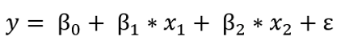
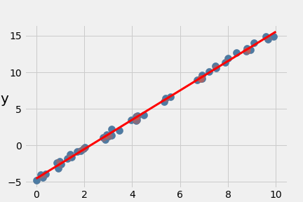
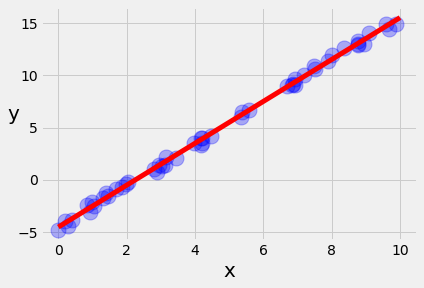
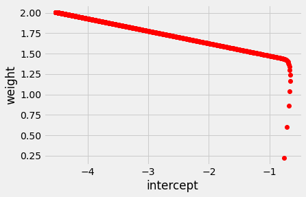
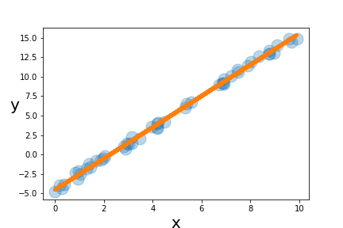

# Linear-regression
使用python3.8練習Linear-regression
## 程式碼來源
from  [https://gist.github.com/jacky308082](https://gist.github.com/jacky308082)

## Linear regression介紹
* Model

  
  
* Goodness of function

  將原本的linear regression放入loss function裡，output會得出這個linear regression有多差，目的是找到β值和ε值可以使loss function最小

* Best function

  求得最佳linear regression
  
* 重要:

  * more complex mode: training error會越低，但testing data不一定(會overfitting)
  * hidden factors: 可以將輸入分群，會有助於優化結果
  
## 程式碼
* 三種方式:
  * Ordinary Least Square
  
      又稱最小平方法，使用最小化誤差的平方來尋找最佳函數分配
  
  * Gradient Descent
  
      又稱梯度下降法，簡單來說就是先隨機訂一個參數, 並套入函式中,求出yhat值,並與實際y值的差異,透過參數(β)+ learning rate(學習率)*gradients(差異*x值)，不斷調整出新的參數，最後就會到達最低點，也就是loss function的最低狀態，與實際y值的誤差最小

  * Scikit learn
  
      最簡單的方法，內建的model已有linear regression程式庫，所以直接輸入數值即可
      
## 成果
* Ordinary Least Square

  
  
* Gradient Descent

  
  
  

* Scikit learn

  
